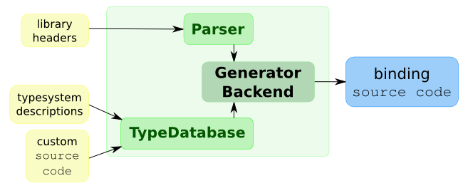

Binding Generation Tutorial
***************************

This tutorial intends to describe the process of binding creation with
|project| and using a very simple Qt4 based library will be used as an
example.

The image below shows the inputs needed to generate the binding source code.

Putting in words, the user provides the headers for the library along with a
typesystem file describing how the classes will be exposed in the target
language, as well as any needed custom source code to be merged with
the generated source code.

This tutorial will go through the steps needed to have the binding
being able to be imported and used from a Python program.

**NOTE:** the binding generator is intended to be used with Qt4 based libraries
only, at least for the time being.

.. toctree::
    :maxdepth: 3

    libfoo
    bindinglibfoo
    typesystemcreation
    globalheader
    buildingthebinding

