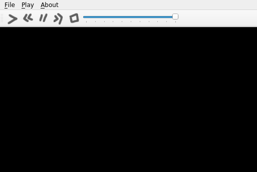

Using `.qrc` Files (`pyside2-rcc`)
**********************************

The `Qt Resource System`_ is a mechanism for storing binary files
in an application.

The most common uses are for custom images, icons, fonts, among others.

In this tutorial you will learn how to load custom images as button icons.

For inspiration, we will try to adapt the multimedia player example
from Qt.

As you can see on the following image, the `QPushButton` that are used
for the media actions (play, pause, stop, and so on) are using the
default icons meant for such actions.

.. image:: player.png
   :alt: Multimedia Player Qt Example

You could make the application more attractive by designing the icons,
but in case you don't want to design them, `download the following set`_
and use them.

You can find more information about the `rcc` command, and `.qrc` file
format, and the resource system in general in the `Qt Resource System`_
site.

.. _`download the following set`: icons/

The `.qrc` file
================

Before running any command, add information about the resources to a `.qrc`
file.
In the following example, notice how the resources are listed in `icons.qrc`

::

    </ui>
    <!DOCTYPE RCC><RCC version="1.0">
    <qresource>
        <file>icons/play.png</file>
        <file>icons/pause.png</file>
        <file>icons/stop.png</file>
        <file>icons/previous.png</file>
        <file>icons/forward.png</file>
    </qresource>
    </RCC>

Generating a Python file
=========================

Now that the `icons.qrc` file is ready, use the `pyside2-rcc` tool to generate
a Python class containing the binary information about the resources

To do this, we need to run::

    pyside2-rcc icons.rc -o rc_icons.py

The `-o` option lets you specify the output filename,
which is `rc_icons.py` in this case.

To use the generated file, add the following import at the top of your main Python file::

    import rc_icons

Changes in the code
===================

As you are modifying an existing example, you need to modify the following
lines:

.. code-block:: python

    from PySide2.QtGui import QIcon, QKeySequence
    playIcon = self.style().standardIcon(QStyle.SP_MediaPlay)
    previousIcon = self.style().standardIcon(QStyle.SP_MediaSkipBackward)
    pauseIcon = self.style().standardIcon(QStyle.SP_MediaPause)
    nextIcon = self.style().standardIcon(QStyle.SP_MediaSkipForward)
    stopIcon = self.style().standardIcon(QStyle.SP_MediaStop)

and replace them with the following:

.. code-block:: python

    from PySide2.QtGui import QIcon, QKeySequence, QPixmap
    playIcon = QIcon(QPixmap(":/icons/play.png"))
    previousIcon = QIcon(QPixmap(":/icons/previous.png"))
    pauseIcon = QIcon(QPixmap(":/icons/pause.png"))
    nextIcon = QIcon(QPixmap(":/icons/forward.png"))
    stopIcon = QIcon(QPixmap(":/icons/stop.png"))

This ensures that the new icons are used instead of the default ones provided
by the application theme.
Notice that the lines are not consecutive, but are in different parts
of the file.

After all your imports, add the following

.. code-block:: python

    import rc_icons

Now, the constructor of your class should look like this:

.. code-block:: python

    def __init__(self):
        super(MainWindow, self).__init__()

        self.playlist = QMediaPlaylist()
        self.player = QMediaPlayer()

        toolBar = QToolBar()
        self.addToolBar(toolBar)

        fileMenu = self.menuBar().addMenu("&File")
        openAction = QAction(QIcon.fromTheme("document-open"),
                             "&Open...", self, shortcut=QKeySequence.Open,
                             triggered=self.open)
        fileMenu.addAction(openAction)
        exitAction = QAction(QIcon.fromTheme("application-exit"), "E&xit",
                             self, shortcut="Ctrl+Q", triggered=self.close)
        fileMenu.addAction(exitAction)

        playMenu = self.menuBar().addMenu("&Play")
        playIcon = QIcon(QPixmap(":/icons/play.png"))
        self.playAction = toolBar.addAction(playIcon, "Play")
        self.playAction.triggered.connect(self.player.play)
        playMenu.addAction(self.playAction)

        previousIcon = QIcon(QPixmap(":/icons/previous.png"))
        self.previousAction = toolBar.addAction(previousIcon, "Previous")
        self.previousAction.triggered.connect(self.previousClicked)
        playMenu.addAction(self.previousAction)

        pauseIcon = QIcon(QPixmap(":/icons/pause.png"))
        self.pauseAction = toolBar.addAction(pauseIcon, "Pause")
        self.pauseAction.triggered.connect(self.player.pause)
        playMenu.addAction(self.pauseAction)

        nextIcon = QIcon(QPixmap(":/icons/forward.png"))
        self.nextAction = toolBar.addAction(nextIcon, "Next")
        self.nextAction.triggered.connect(self.playlist.next)
        playMenu.addAction(self.nextAction)

        stopIcon = QIcon(QPixmap(":/icons/stop.png"))
        self.stopAction = toolBar.addAction(stopIcon, "Stop")
        self.stopAction.triggered.connect(self.player.stop)
        playMenu.addAction(self.stopAction)

        # many lines were omitted

Executing the example
=====================

Run the application by calling `python main.py` to checkout the new icon-set:

.. _`Qt Resource System`: https://doc.qt.io/qt-5/resources.html
