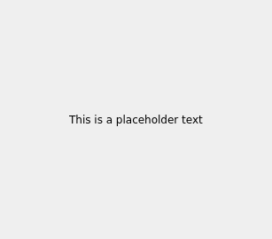
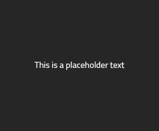
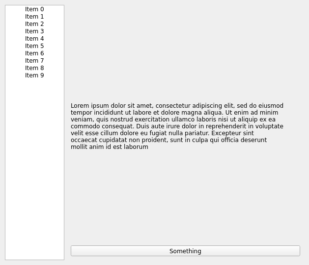
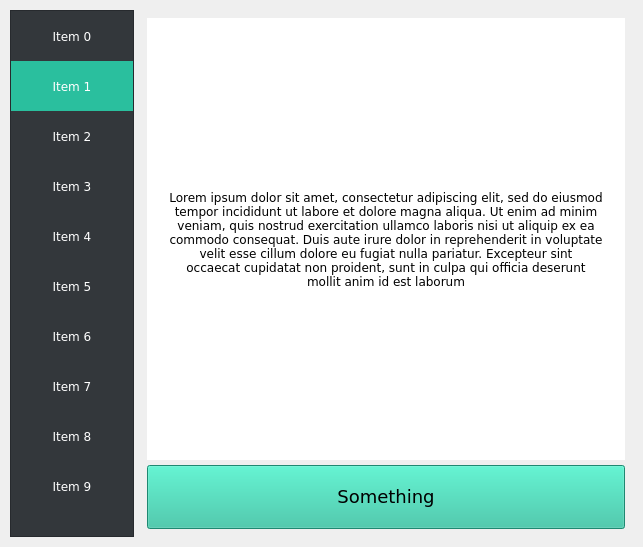

Widget Styling
**************

Qt Widgets application use a default theme depending on the platform.
In some cases, there are system-wide configurations that modify the Qt theme,
and applications are displayed differently.

However, you can take care of your own widgets and provide a custom style
to each component. As an example, look at the following simple snippet:

.. code-block:: python

    import sys
    from PySide2.QtCore import Qt
    from PySide2.QtWidgets import QApplication, QLabel

    if __name__ == "__main__":
        app = QApplication()
        w = QLabel("This is a placeholder text")
        w.setAlignment(Qt.AlignCenter)
        w.show()
        sys.exit(app.exec_())

When you execute this code, you will see a simple `QLabel` aligned at the
center, and with a placeholder text.

You can style your application using the CSS-like syntax.
For more information, see `Qt Style Sheets Reference`_.

A `QLabel` can be styled differently by setting some of its CSS
properties, such as `background-color` and `font-family`,
so let's see how does the code look like with these changes:

.. code-block:: python

    import sys
    from PySide2.QtCore import Qt
    from PySide2.QtWidgets import QApplication, QLabel

    if __name__ == "__main__":
        app = QApplication()
        w = QLabel("This is a placeholder text")
        w.setAlignment(Qt.AlignCenter)
        w.setStyleSheet("""
            background-color: #262626;
            color: #FFFFFF;
            font-family: Titillium;
            font-size: 18px;
            """)
        w.show()
        sys.exit(app.exec_())

Now when you run the code, notice that the `QLabel` looks different with your
custom style:

.. note::

  If you don't have the font `Titillium` installed, you can try with any
  other you prefer.
  Remember you can list your installed fonts using `QFontDatabase`,
  specifically the `families()` method.

Styling each UI element separately like you did in the previous snippet is a
lot of work. The easier alternative for this is to use Qt Style Sheets,
which is one or more `.qss` files defining the style for the UI elements in
your application.

More examples can be found in the `Qt Style Sheet Examples`_ documentation
page.

.. _`Qt Style Sheets Reference`: https://doc.qt.io/qt-5/stylesheet-reference.html
.. _`Qt Style Sheet Examples`: https://doc.qt.io/qt-5/stylesheet-examples.html

Qt Style Sheets
===============

.. warning::

  Before starting modifying your application, keep in mind that you will be
  responsible for all the graphical details of the application.
  Altering margins, and sizes might end up looking strange or incorrect, so you
  need to be careful when altering the style.
  It's recommended to create a full new Qt style to cover all the possible
  corner cases.

A `qss` file is quite similar to a CSS file, but you need to specify the Widget
component and optionally the name of the object::

    QLabel {
        background-color: red;
    }

    QLabel#title {
        font-size: 20px;
    }

The first style defines a `background-color` for all `QLabel` objects in your
application, whereas the later one styles the `title` object only.

.. note::

  You can set object names with the `setObjectName(str)` function to any Qt
  object, for example: for a `label = QLabel("Test")`, you can write
  `label.setObjectName("title")`

Once you have a `qss` file for your application, you can apply it by reading
the file and using the `QApplication.setStyleSheet(str)` function:

.. code-block:: python

    if __name__ == "__main__":
        app = QApplication()

        w = Widget()
        w.show()

        with open("style.qss", "r") as f:
            _style = f.read()
            app.setStyleSheet(_style)

        sys.exit(app.exec_())

Having a general `qss` file allows you to decouple the styling aspects of
the code, without mixing it in the middle of the general functionality, and you
can simply enable it or disable it.

Look at this new example, with more widgets components:

.. literalinclude:: widgetstyling.py
   :linenos:
   :lines: 59-81

This displays a two column widget, with a `QListWidget` on the left and a
`QLabel` and a `QPushButton` on the right. It looks like this when you run the
code:

If you add content to the previously described `style.qss` file, you can modify
the look-n-feel of the previous example:

.. literalinclude:: style.qss
   :linenos:

The style changes mainly the color of the different widgets, alter the
alignment, and includes some spacing.
You can also use state-based styling on the QListWidget *items* for example, to
style them differently depending on whether they are *selected* or not.

After applying all the styling alternatives you explored in this topic, notice
that the `QLabel` example looks a lot different now.
Try running the code to check its new look:

You have the freedom to tune your style sheets and provide a really nice
look-n-feel to all your applications.
