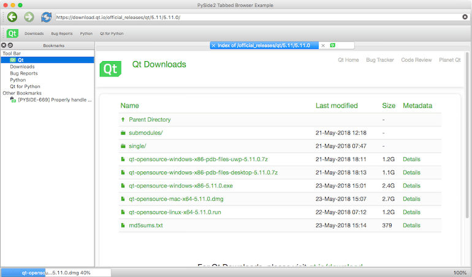

**********************
Web Browser Example
**********************

The example demonstrates the power and simplicity offered by |project| to developers.
It uses several |pymodname| submodules to offer a fluid and modern-looking UI that
is apt for a web browser. The application offers the following features:
    * Tab-based browsing experience using QTabWidget.
    * Download manager using a QProgressBar and QWebEngineDownloadItem.
    * Bookmark manager using QTreeView.

The application's code is organized in several parts for ease of maintenance. For example,
:code:`DownloadWidget` provides a widget to track progress of a download item. In the following
sections, these different parts are discussed briefly to help you understand the Python code behind
them a little better.

BookmarkWidget or :code:`bookmarkwidget.py`
===========================================

This is a widget that docks to the left of the main window by default. It inherits QTreeView and
loads a default set of bookmarks using a QStandardItemModel. The model is populated at startup
for a JSON file, which is updated when you add or remove bookmarks from the tree view.

.. automodule:: bookmarkwidget
   :members:

DownloadWidget or :code:`downloadwidget.py`
=============================================

This is a widget that tracks progress of the download item. It inherits QProgressBar to display
progress of the QWebEngineDownloadItem instance, and offers a context-menu with actions such as Launch,
Show in folder, Cancel, and Remove.

.. automodule:: downloadwidget
   :members:

BrowserTabWidget or :code:`browsertabwidget.py`
===============================================

This is a widget that includes a QWebEngineView to enable viewing web pages. It docks to the right
of BookmarkWidget in the main window.

.. automodule:: browsertabwidget
   :members:

MainWindow or :code:`main.py`
=============================

This is the parent window that collates all the other widgets together to offer the complete package.

.. automodule:: main
   :members:

Try running the example to explore it further.
