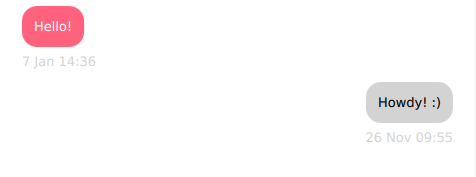

QML, SQL and PySide Integration Tutorial
########################################

This tutorial is very similar to the `Qt Chat Tutorial`_ one but it focuses on explaining how to
integrate a SQL database into a PySide2 application using QML for its UI.

.. _`Qt Chat Tutorial`: https://doc.qt.io/qt-5/qtquickcontrols-chattutorial-example.html

sqlDialog.py
------------

We import the pertinent libraries to our program, define a global variable that hold the
name of our table, and define the global function ``createTable()`` that creates a new table if it
doesn't already exist.
The database contains a single line to mock the beginning of a conversation.

   .. literalinclude:: sqlDialog.py
      :linenos:
      :lines: 40-77

The ``SqlConversationModel`` class offers the read-only data model required for the non-editable
contacts list. It derives from the :ref:`QSqlQueryModel` class, which is the logical choice for
this use case.
Then, we proceed to create the table, set its name to the one defined previously with the
:meth:`~.QSqlTableModel.setTable` method.
We add the necessary attributes to the table, to have a program that reflects the idea
of a chat application.

   .. literalinclude:: sqlDialog.py
      :linenos:
      :lines: 80-91

In ``setRecipient()``, you set a filter over the returned results from the database, and
emit a signal every time the recipient of the message changes.

   .. literalinclude:: sqlDialog.py
      :linenos:
      :lines: 93-103

The ``data()`` function falls back to ``QSqlTableModel``'s implementation if the role is not a
custom user role.
If you get a user role, we can subtract :meth:`~.QtCore.Qt.UserRole` from it to get the index of
that field, and then use that index to find the value to be returned.

   .. literalinclude:: sqlDialog.py
      :linenos:
      :lines: 105-112

In ``roleNames()``, we return a Python dictionary with our custom role and role names as key-values
pairs, so we can use these roles in QML.
Alternatively, it can be useful to declare an Enum to hold all of the role values.
Note that ``names`` has to be a hash to be used as a dictionary key,
and that's why we're using the ``hash`` function.

   .. literalinclude:: sqlDialog.py
      :linenos:
      :lines: 114-128

The ``send_message()`` function uses the given recipient and message to insert a new record into
the database.
Using :meth:`~.QSqlTableModel.OnManualSubmit` requires you to also call ``submitAll()``,
since all the changes will be cached in the model until you do so.

   .. literalinclude:: sqlDialog.py
      :linenos:
      :lines: 130-146

chat.qml
--------

Let's look at the ``chat.qml`` file.

   .. literalinclude:: chat.qml
      :linenos:
      :lines: 40-42

First, import the Qt Quick module.
This gives us access to graphical primitives such as Item, Rectangle, Text, and so on.
For a full list of types, see the `Qt Quick QML Types`_ documentation.
We then add QtQuick.Layouts import, which we'll cover shortly.

Next, import the Qt Quick Controls module.
Among other things, this provides access to ``ApplicationWindow``, which replaces the existing
root type, Window:

Let's step through the ``chat.qml`` file.

   .. literalinclude:: chat.qml
      :linenos:
      :lines: 44-49

``ApplicationWindow`` is a Window with some added convenience for creating a header and a footer.
It also provides the foundation for popups and supports some basic styling, such as the background
color.

There are three properties that are almost always set when using ApplicationWindow: ``width``,
``height``, and ``visible``.
Once we've set these, we have a properly sized, empty window ready to be filled with content.

There are two ways of laying out items in QML: `Item Positioners`_ and `Qt Quick Layouts`_.

- Item positioners (`Row`_, `Column`_, and so on) are useful for situations where the size of items
  is known or fixed, and all that is required is to neatly position them in a certain formation.
- The layouts in Qt Quick Layouts can both position and resize items, making them well suited for
  resizable user interfaces.
  Below, we use `ColumnLayout`_ to vertically lay out a `ListView`_ and a `Pane`_.

     .. literalinclude:: chat.qml
        :linenos:
        :lines: 50-53

Pane is basically a rectangle whose color comes from the application's style.
It's similar to `Frame`_, but it has no stroke around its border.

Items that are direct children of a layout have various `attached properties`_ available to them.
We use `Layout.fillWidth`_ and `Layout.fillHeight`_ on the `ListView`_ to ensure that it takes as
much space within the `ColumnLayout`_ as it can, and the same is done for the Pane.
As `ColumnLayout`_ is a vertical layout, there aren't any items to the left or right of each child,
so this results in each item consuming the entire width of the layout.

On the other hand, the `Layout.fillHeight`_ statement in the `ListView`_ enables it to occupy the
remaining space that is left after accommodating the Pane.

.. _Item Positioners: https://doc.qt.io/qt-5/qtquick-positioning-layouts.html
.. _Qt Quick Layouts: https://doc.qt.io/qt-5/qtquicklayouts-index.html
.. _Row: https://doc.qt.io/qt-5/qml-qtquick-row.html
.. _Column: https://doc.qt.io/qt-5/qml-qtquick-column.html
.. _ColumnLayout: https://doc.qt.io/qt-5/qml-qtquick-layouts-columnlayout.html
.. _ListView: https://doc.qt.io/qt-5/qml-qtquick-listview.html
.. _Pane: https://doc.qt.io/qt-5/qml-qtquick-controls2-pane.html
.. _Frame: https://doc.qt.io/qt-5/qml-qtquick-controls2-frame.html
.. _attached properties: https://doc.qt.io/qt-5/qml-qtquick-layouts-layout.html
.. _Layout.fillWidth: https://doc.qt.io/qt-5/qml-qtquick-layouts-layout.html#fillWidth-attached-prop
.. _Layout.fillHeight: https://doc.qt.io/qt-5/qml-qtquick-layouts-layout.html#fillHeight-attached-prop
.. _ListView: https://doc.qt.io/qt-5/qml-qtquick-listview.html
.. _Qt Quick QML Types: https://doc.qt.io/qt-5/qtquick-qmlmodule.html

Let's look at the ``Listview`` in detail:

   .. literalinclude:: chat.qml
      :linenos:
      :lines: 53-99

After filling the ``width`` and ``height`` of its parent, we also set some margins on the view.

Next, we set `displayMarginBeginning`_ and `displayMarginEnd`_.
These properties ensure that the delegates outside the view don't disappear when you
scroll at the edges of the view.
To get a better understanding, consider commenting out the properties and then rerun your code.
Now watch what happens when you scroll the view.

We then flip the vertical direction of the view, so that first items are at the bottom.

Additionally, messages sent by the contact should be distinguished from those sent by a contact.
For now, when a message is sent by you, we set a ``sentByMe`` property, to alternate between
different contacts.
Using this property, we distinguish between different contacts in two ways:

* Messages sent by the contact are aligned to the right side of the screen by setting
  ``anchors.right`` to ``parent.right``.
* We change the color of the rectangle depending on the contact.
  Since we don't want to display dark text on a dark background, and vice versa, we also set the
  text color depending on who the contact is.

At the bottom of the screen, we place a `TextArea`_ item to allow multi-line text input, and a
button to send the message.
We use Pane to cover the area under these two items:

   .. literalinclude:: chat.qml
      :linenos:
      :lines: 101-125

The `TextArea`_ should fill the available width of the screen.
We assign some placeholder text to provide a visual cue to the contact as to where they should begin
typing.
The text within the input area is wrapped to ensure that it does not go outside of the screen.

Lastly, we have a button that allows us to call the ``send_message`` method we defined on
``sqlDialog.py``, since we're just having a mock up example here and there is only one possible
recipient and one possible sender for this conversation we're just using strings here.

.. _displayMarginBeginning: https://doc.qt.io/qt-5/qml-qtquick-listview.html#displayMarginBeginning-prop
.. _displayMarginEnd: https://doc.qt.io/qt-5/qml-qtquick-listview.html#displayMarginEnd-prop
.. _TextArea: https://doc.qt.io/qt-5/qml-qtquick-controls2-textarea.html

main.py
-------

We use ``logging`` instead of Python's ``print()``, because it provides a better way to control the
messages levels that our application will generate (errors, warnings, and information messages).

   .. literalinclude:: main.py
      :linenos:
      :lines: 40-50

``connectToDatabase()`` creates a connection with the SQLite database, creating the actual file
if it doesn't already exist.

   .. literalinclude:: main.py
      :linenos:
      :lines: 53-72

A few interesting things happen in the ``main`` function:

- Declaring a :ref:`QGuiApplication`.
  You should use a :ref:`QGuiApplication` instead of :ref:`QApplication` because we're not
  using the **QtWidgets** module.
- Connecting to the database,
- Declaring a :ref:`QQmlApplicationEngine`.
  This allows you to access the QML context property to connect Python
  and QML from the conversation model we built on ``sqlDialog.py``.
- Loading the ``.qml`` file that defines the UI.

Finally, the Qt application runs, and your program starts.

   .. literalinclude:: main.py
      :linenos:
      :lines: 75-85

