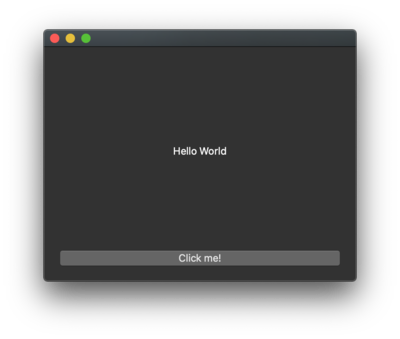

|project| Quick start
======================

Requirements
------------

Before you can install |project|, first you must install the following software:

 * Python 3.6+,
 * We recommend using a virtual environment, such as
   `venv <https://docs.python.org/3/library/venv.html>`_ or
   `virtualenv <https://virtualenv.pypa.io/en/latest>`_

Creating and activating an environment
--------------------------------------

You can do this by running the following on a terminal::

  $ python -m venv env/       # Your binary is maybe called 'python3'
  $ source env/bin/activate   # for Linux and macOS
  $ env\Scripts\activate.bat  # for Windows

Installation
------------

Now you are ready to install the |project| packages using ``pip``.
From the terminal, run the following command::

    # For the latest version on PyPi
    pip install PySide6

    # For a specific version
    pip install PySide6==5.15.0

or::

    pip install --index-url=http://download.qt.io/snapshots/ci/pyside/5.15/latest pyside6 --trusted-host download.qt.io

Test your Installation
----------------------

Now that you have |project| installed, you can test your setup by running the following Python
constructs to print version information::

    import PySide6.QtCore

    # Prints PySide6 version
    print(PySide6.__version__)

    # Prints the Qt version used to compile PySide6
    print(PySide6.QtCore.__version__)

.. note::

    As it happened in 5.14.2, PySide had a couple of new releases to fix
    issues in 5.14.2, adding yet another version level. In that case, you
    will have different versions being shown for Qt and PySide.

Create a Simple Application
---------------------------

Your |project| setup is ready. You can explore it further by developing a simple application
that prints "Hello World" in several languages. The following instructions will
guide you through the development process:

1. Create a new file named :code:`hello_world.py`, and add the following imports to it.::

        import sys
        import random
        from PySide6 import QtCore, QtWidgets, QtGui

  The |pymodname| Python module provides access to the Qt APIs as its submodule.
  In this case, you are importing the :code:`QtCore`, :code:`QtWidgets`, and :code:`QtGui` submodules.

2. Define a class named :code:`MyWidget`, which extends QWidget and includes a QPushButton and
   QLabel.::

        class MyWidget(QtWidgets.QWidget):
            def __init__(self):
                super().__init__()

                self.hello = ["Hallo Welt", "Hei maailma", "Hola Mundo", "Привет мир"]

                self.button = QtWidgets.QPushButton("Click me!")
                self.text = QtWidgets.QLabel("Hello World",
                                             alignment=QtCore.Qt.AlignCenter)

                self.layout = QtWidgets.QVBoxLayout()
                self.layout.addWidget(self.text)
                self.layout.addWidget(self.button)
                self.setLayout(self.layout)

                self.button.clicked.connect(self.magic)

            @QtCore.Slot()
            def magic(self):
                self.text.setText(random.choice(self.hello))

  The MyWidget class has the :code:`magic` member function that randomly chooses an item from the
  :code:`hello` list. When you click the button, the :code:`magic` function is called.

3. Now, add a main function where you instantiate :code:`MyWidget` and :code:`show` it.::

        if __name__ == "__main__":
            app = QtWidgets.QApplication([])

            widget = MyWidget()
            widget.resize(800, 600)
            widget.show()

            sys.exit(app.exec_())

Run your example. Try clicking the button at the bottom to see which greeting you get.

