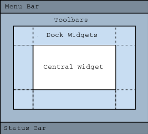

Chapter 3 - Create an empty QMainWindow
==========================================

You can now think of presenting your data in a UI. A QMainWindow provides a
convenient structure for GUI applications, such as a menu bar and status bar.
The following image shows the layout that QMainWindow offers out-of-the box:

In this case, let your application inherit from QMainWindow, and add the
following UI elements:

* A "File" menu to open a File dialog.
* An "Exit" menu close the window.
* A status message on the status bar when the application starts.

In addition, you can define a fixed size for the window or adjust it based on
the resolution you currently have. In the following snippet, you will see how
window size is defined based on available screen width (80%) and height (70%).

.. note:: You can achieve a similar structure using other Qt elements like
   QMenuBar, QWidget, and QStatusBar. Refer the QMainWindow layout for
   guidance.

.. literalinclude:: datavisualize3/main_window.py
   :language: python
   :linenos:
   :lines: 40-

Try running the script to see what output you get with it.
