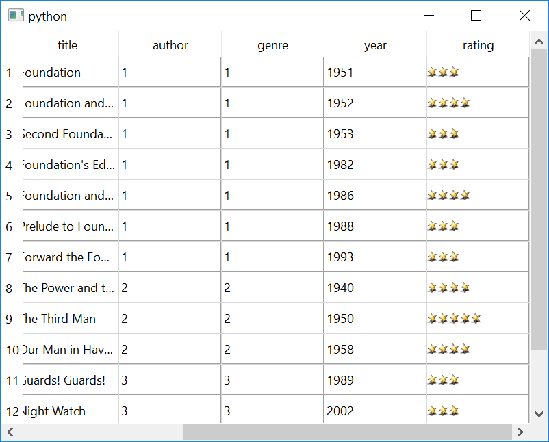

Chapter 2: ``bookdelegate.cpp`` to ``bookdelegate.py``
*******************************************************

Now that your database is in place, port the C++ code for the
``BookDelegate`` class. This class offers a delegate to present
and edit the data in a ``QTableView``. It inherits
``QSqlRelationalDelegate`` interface, which offers features
specific for handling relational databases, such as a combobox
editor for foreign key fields. To begin with, create
``bookdelegate.py`` and add the following imports to it:

.. literalinclude:: bookdelegate.py
   :language: python
   :linenos:
   :lines: 40-47

After the necessary ``import`` statements, port the
constructor code for the ``BookDelegate`` class. Both
the C++ and Python versions of this code initialize a
``QSqlRelationalDelegate`` and ``QPixmap`` instance.
Here is how they look:

C++ version
-------------

.. literalinclude:: bookdelegate.cpp
   :language: c++
   :linenos:
   :lines: 54-59

Python version
---------------

.. literalinclude:: bookdelegate.py
   :language: python
   :linenos:
   :lines: 47-54

.. note:: The Python version loads the ``QPixmap`` using
   the absolute path of ``star.png`` in the local
   filesystem.

As the default functionality offered by the
``QSqlRelationalDelegate`` is not enough to present
the books data, you must reimplement a few functions.
For example, painting stars to represent the rating for
each book in the table. Here is how the reimplemented
code looks like:

C++ version
------------

.. literalinclude:: bookdelegate.cpp
   :language: c++
   :linenos:
   :lines: 59-

Python version
---------------

.. literalinclude:: bookdelegate.py
   :language: python
   :linenos:
   :lines: 55-

Now that the delegate is in place, run the following
``main.py`` to see how the data is presented:

.. literalinclude:: main.py
   :language: python
   :linenos:
   :lines: 40-

Here is how the application will look when you run it:

The only difference you'll notice now in comparison to
:doc:`chapter 1 <../chapter1/chapter1>` is that the
``rating`` column looks different.

Try improving the table even further by adding these
features:

* Title for each column
* SQL relation for the ``author_id`` and ``genre_id`` columns
* Set a title to the window

With these features, this is how your table will look like:

.. image:: images/chapter2_books_with_relation.png
   :alt: Books table with SQL relation
