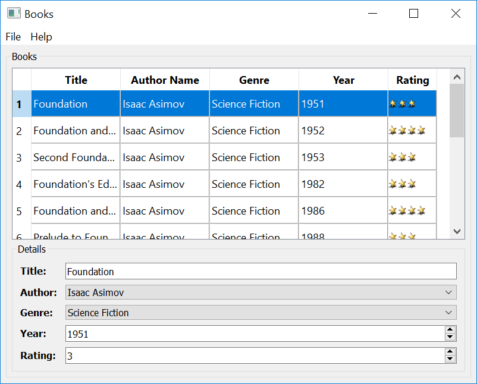

Chapter 3: Port ``bookdwindow.cpp`` to ``bookwindow.py``
*********************************************************

After the bookdelegate, port the C++ code for the
``BookWindow`` class. It offers a QMainWindow, containing a
``QTableView`` to present the books data, and a **Details**
section with a set of input fields to edit the selected row
in the table. To begin with, create the ``bookwindow.py``
and add the following imports to it:

.. literalinclude:: bookwindow.py
   :language: python
   :linenos:
   :lines: 40-53

.. note:: The imports include the ``BookDelegate`` you
   ported earlier and the ``Ui_BookWindow``. The pyside-uic
   tool generates the ``ui_bookwindow`` Python code based
   on the ``bookwindow.ui`` XML file.

To generate this Python code, run the following command on the
prompt:

.. code-block::

   pyside6-uic bookwindow.ui > ui_bookwindow.py

Try porting the remaining code now. To begin with, here is
how both the versions of the constructor code looks:

C++ version
------------

.. literalinclude:: bookwindow.cpp
   :language: c++
   :linenos:
   :lines: 57-140

Python version
---------------

.. literalinclude:: bookwindow.py
   :language: python
   :linenos:
   :lines: 53-116

.. note:: The Python version of the ``BookWindow`` class
   definition inherits from both ``QMainWindow`` and
   ``Ui_BookWindow``, which is defined in the
   ``ui_bookwindow.py`` file that you generated earlier.

Here is how the rest of the code looks like:

C++ version
------------

.. literalinclude:: bookwindow.cpp
   :language: c++
   :linenos:
   :lines: 115-

Python version
---------------

.. literalinclude:: bookwindow.py
   :language: python
   :linenos:
   :lines: 117-

Now that all the necessary pieces are in place, try to put
them together in ``main.py``.

.. literalinclude:: main.py
   :language: python
   :linenos:
   :lines: 40-

Try running this to see if you get the following output:

Now, if you look back at :doc:`chapter2 <../chapter2/chapter2>`,
you'll notice that the ``bookdelegate.py`` loads the
``star.png`` from the filesytem. Instead, you could add it
to a ``qrc`` file, and load from it. The later approach is
rececommended if your application is targeted for
different platforms, as most of the popular platforms
employ stricter file access policy these days.

To add the ``star.png`` to a ``.qrc``, create a file called
``books.qrc`` and the following XML content to it:

.. literalinclude:: books.qrc
   :linenos:

This is a simple XML file defining a list all resources that
your application needs. In this case, it is the ``star.png``
image only.

Now, run the ``pyside6-rcc`` tool on the ``books.qrc`` file
to generate ``rc_books.py``.

.. code-block::

   pyside6-rcc books.qrc > rc_books.py

Once you have the Python script generated, make the
following changes to ``bookdelegate.py`` and ``main.py``:

.. literalinclude:: bookdelegate.py
   :diff: ../chapter2/bookdelegate.py

.. literalinclude:: main.py
   :diff: main-old.py

Although there will be no noticeable difference in the UI
after these changes, using a ``.qrc`` is a better approach.

Now that you have successfully ported the SQL Books example,
you know how easy it is. Try porting another C++ application.
